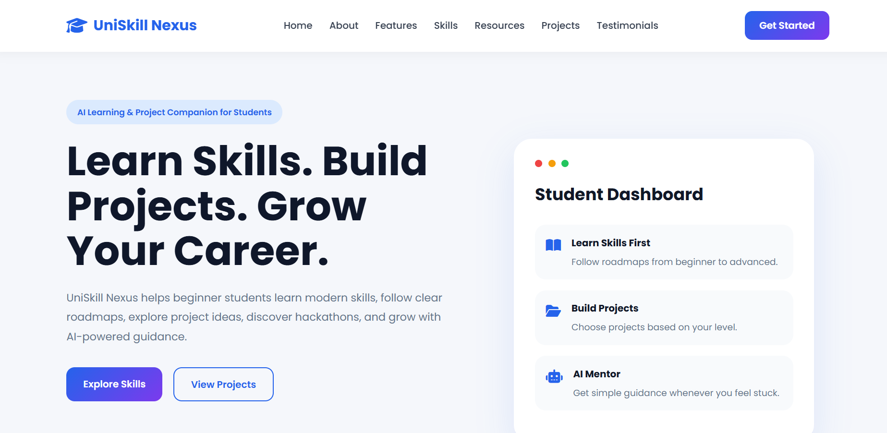
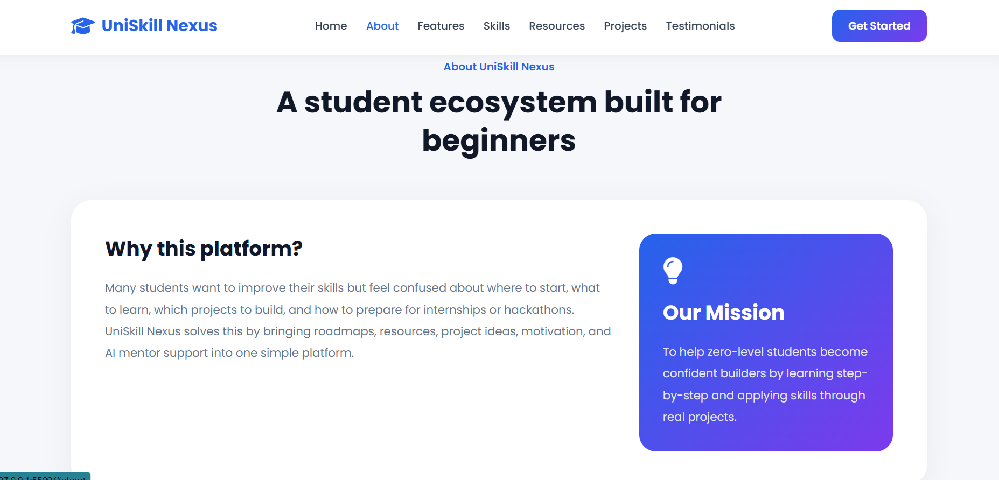
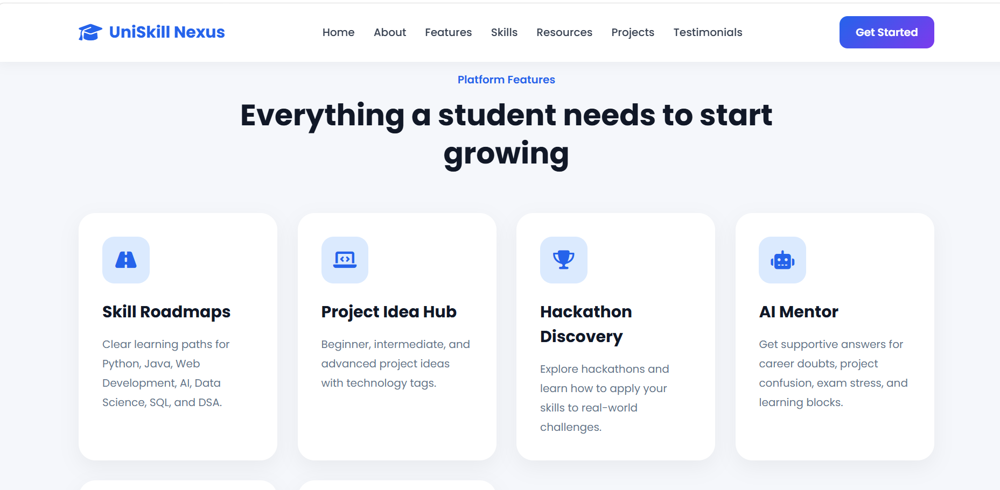
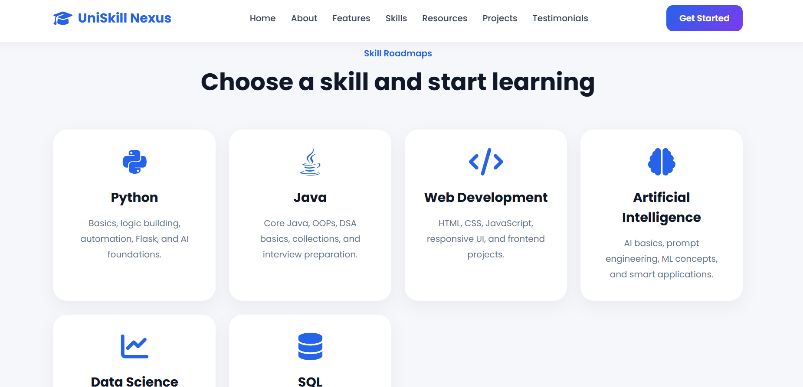
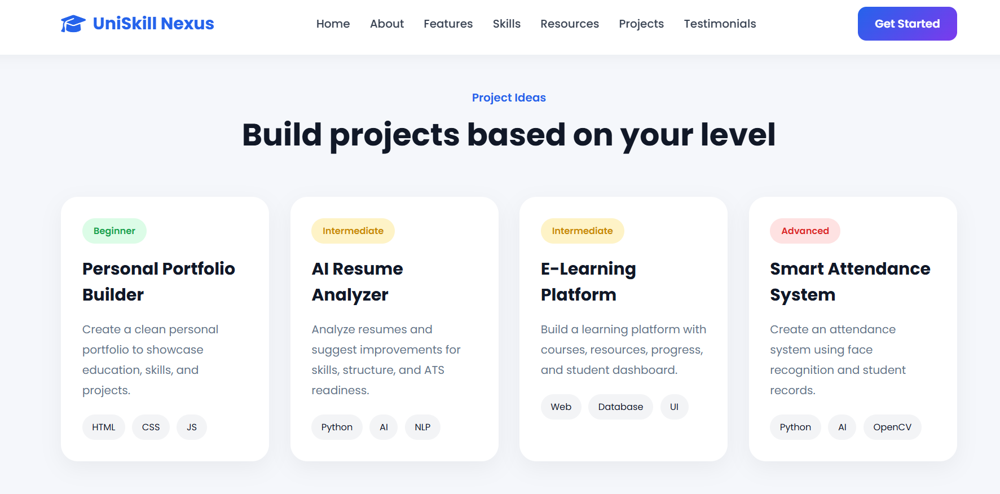
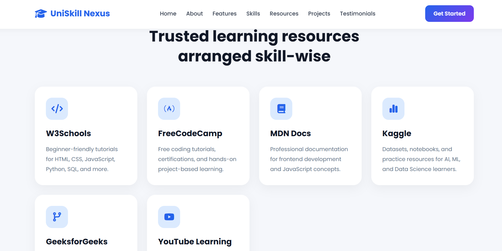
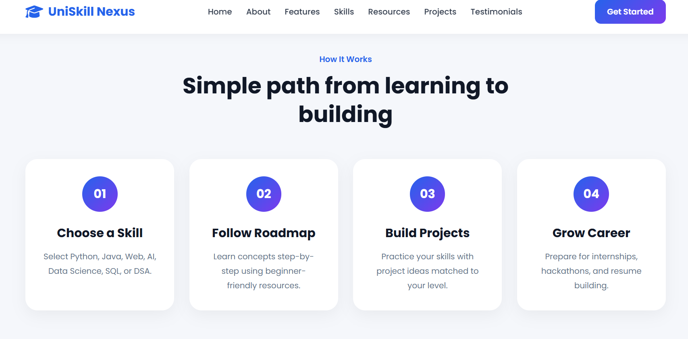

# UniSkill Nexus — Learn. Build. Grow.

## AI Learning & Project Companion for Students
# Project Type

This project is a responsive fictional startup landing page prototype developed for the Jr. Web Developer Internship Assessment.

The current version focuses on:
- frontend UI/UX design
- feature presentation
- workflow explanation
- student-focused experience
- responsive layout
- modern landing page structure

This is the landing page prototype version of UniSkill Nexus.

Future versions can be expanded into a complete full-stack platform with:
- authentication system
- personalized dashboards
- AI chatbot integration
- progress tracking
- internship portal
- community features
- real database integration

UniSkill Nexus is a fictional startup landing page designed to help beginner students learn modern technical skills, build real-world projects, discover opportunities, and grow their careers with structured guidance.

This platform is specially designed for students who feel confused about:
- where to start learning
- what skills to choose
- which resources to follow
- what projects to build
- how to prepare for internships and hackathons

The platform combines skill roadmaps, learning resources, project ideas, AI mentor support, and career guidance into one student-focused ecosystem.

---

# Problem Statement

Many students start learning technology through random tutorials and videos without a clear roadmap or direction.

Common problems students face:
- No structured learning path
- Too many scattered resources
- Difficulty choosing projects
- Lack of mentorship and guidance
- Confusion about internships and career preparation
- Loss of motivation while learning

UniSkill Nexus aims to solve these problems by giving students a single platform for learning, building, and growing.

---

# Solution

UniSkill Nexus provides:
- Step-by-step learning roadmaps
- Curated beginner-friendly resources
- Project ideas based on skill level
- AI-powered mentor guidance
- Hackathon discovery support
- Career readiness guidance

The goal is to help zero-level students become confident builders.

---

# Core Features

## 1. Skill Roadmaps
The platform includes structured roadmaps for:
- Python
- Java
- Web Development
- Artificial Intelligence
- Data Science
- SQL
- DSA

Each roadmap guides students from beginner concepts to advanced topics.

---

## 2. Curated Learning Resources
Students can access trusted learning resources such as:
- W3Schools
- FreeCodeCamp
- MDN Documentation
- Kaggle
- GeeksforGeeks
- YouTube Tutorials

Resources are organized skill-wise to reduce confusion.

---

## 3. Project Idea Hub
The platform provides:
- Beginner projects
- Intermediate projects
- Advanced projects

Each project contains:
- Technology tags
- Skill relevance
- Difficulty level
- Practical learning focus

This helps students build portfolio-ready projects.

---

## 4. AI Mentor Guidance
One of the main features is the AI Mentor.

The AI Mentor helps students with:
- Learning confusion
- Project guidance
- Resume doubts
- Career preparation
- Motivation support
- Internship readiness

The platform gives students a supportive learning experience instead of only static tutorials.

---

## 5. Hackathon Discovery
Students can explore:
- Smart India Hackathon
- Google Solution Challenge
- College Hackathons
- Innovation Competitions

The platform encourages students to apply their learning through real-world problem solving.

---

## 6. Career Readiness Support
The platform also focuses on career growth through:
- Resume guidance
- Portfolio improvement
- GitHub guidance
- Internship preparation
- Project showcase ideas

---

# How The Platform Works

## Step 1 — Choose a Skill
The student selects a learning path such as Python, Java, Web Development, AI, or DSA.

## Step 2 — Follow the Roadmap
The platform provides a structured roadmap with beginner-friendly resources.

## Step 3 — Build Projects
Students apply their learning through practical projects.

## Step 4 — Improve Career Profile
Students use projects, portfolios, GitHub, and resumes to prepare for internships and opportunities.

---

# Website Workflow

The website is designed as a modern responsive landing page.

## Landing Page Structure
The website contains:
- Navbar
- Hero Section
- About Section
- Features Section
- Skill Roadmaps
- Project Ideas
- Workflow Section
- AI Mentor Preview
- Testimonials
- Footer

---

# User Experience Focus

The website focuses on:
- Clean UI
- Smooth animations
- Responsive design
- Beginner-friendly layout
- Easy navigation
- Modern startup appearance

Animations and scroll effects are used to create a professional website experience.

---

# Technologies Used

## Frontend
- HTML
- CSS
- JavaScript

## Design Tools
- Google Fonts
- Font Awesome Icons

## Development Tools
- VS Code
- GitHub

---

# Responsive Design

The website is fully responsive and adapts to:
- Desktop screens
- Tablets
- Mobile devices

Responsive layouts and flexible grids are used for better user experience.

---

# Future Improvements

Future versions of UniSkill Nexus can include:

## Authentication System
- Student login/signup
- Personalized dashboard

## Progress Tracking
- Skill completion tracking
- Learning streaks
- Achievement badges

## Real AI Integration
- Chatbot support using AI APIs
- Personalized recommendations

## Community Features
- Student discussion forums
- Team collaboration
- Peer learning groups

## Internship Integration
- Internship recommendations
- Company hiring updates
- Resume analysis

## Hackathon Dashboard
- Live hackathon tracking
- Team formation system
- Submission support

---

# Challenges Faced

During development:
- Maintaining clean responsive layout
- Creating smooth section animations
- Structuring content clearly
- Designing beginner-friendly UI
- Organizing multiple sections without clutter

These challenges helped improve frontend development understanding.

---

# What I Learned

Through this project I learned:
- Responsive website development
- UI/UX structuring
- Section-based landing page design
- Smooth scroll animations
- Modern frontend styling
- Website content organization
- User-focused design thinking

---

# Why This Project Is Different

Most learning websites only provide tutorials.

UniSkill Nexus combines:
- Learning
- Project building
- Career preparation
- AI guidance
- Motivation
- Hackathon exposure

This creates a complete student growth ecosystem instead of only a tutorial website.

---
# Website Preview

## Hero Section

## About Section

## Feature Section

## Skill Section

## Project Section

## Resource Section

## Platform Workflow

# Conclusion

UniSkill Nexus is designed to help beginner students move from confusion to confidence.

The platform focuses on:
- structured learning
- practical project building
- career growth
- mentorship support

The vision is to create a platform where students can:
Learn. Build. Grow.

---

# Developed For
SuPrazo Technologies — Jr. Web Developer Internship Assessment

---

# Developer
Siri Vennela
B.Tech Information Technology Student